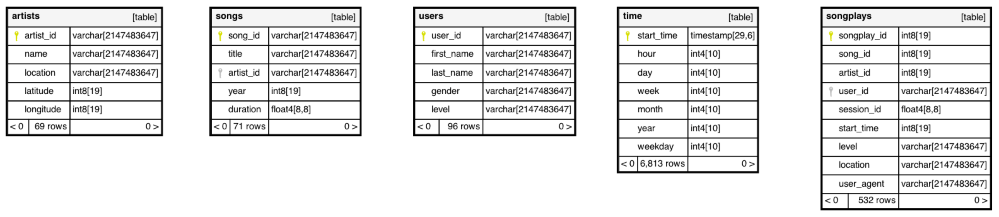

# Data Modelling with Postgres

The aim of this project is to load data on songs, and user activity on a music streaming service, 
into a Postgress based relational database. The database will be structured using a star schema.

## Contents

The project directory contains the following files:

| File | Description |
| ---- | ----------- |
| `sql_queries.py` | A python module (to be `import`'ed) that includes all SQL statements |
| `create_tables.py` | Python script to execute DDL recreate the database and empty tables from scratch. |
| `etl.ipynb` | Jupyter notebook to extract, transform and load (ETL) the data, from a subset of JSON files into the database |
| `etl.py` | The ETL script based on the previous notebook, which process all JSON files found in the `log_data` and `song_data` directories. |
| `run-postgres.sh` | Script to start local Docker container running the Postgres image. |
| `sql_queries.py` | Quaery the data in the fact table and dimension tables. |

## Schema

A mentioned, a star schema is used, consisting of a fact table, and a number of dimension tables.
The fact table `songplays` captures the event of playing a new song. Associated with it are the following dimension tables:

| Table | Usage |
| ----- | ----- |
| `users` | Records each user of the streaming service, including if they are paying for the service. |
| `songs` | Records iformation about the songs that users choose to listen to. |
| `artists` | Records information about the artists that perform the songs. |
| `time` | Records information related to the event in time at which users choose to play songs. |

The following image illustrates this schema:

